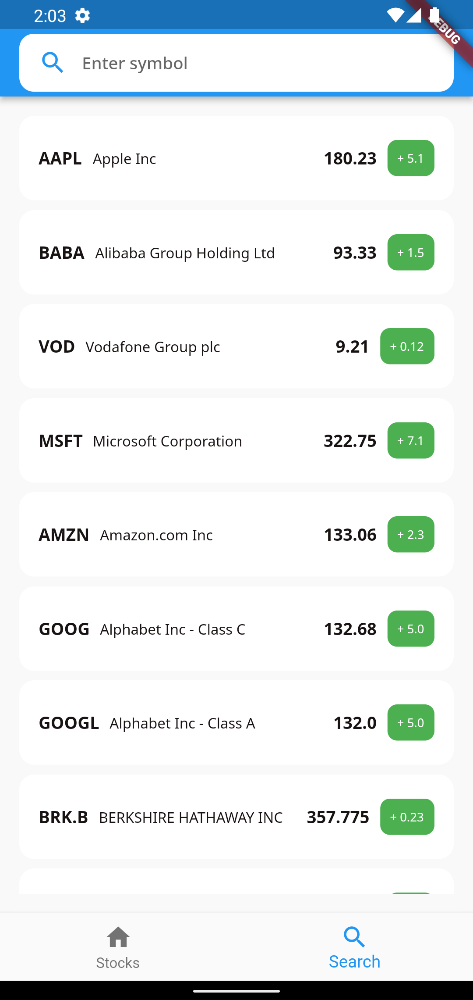
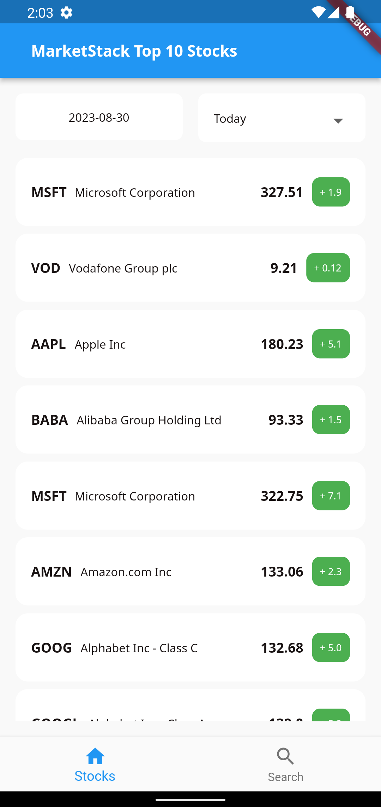
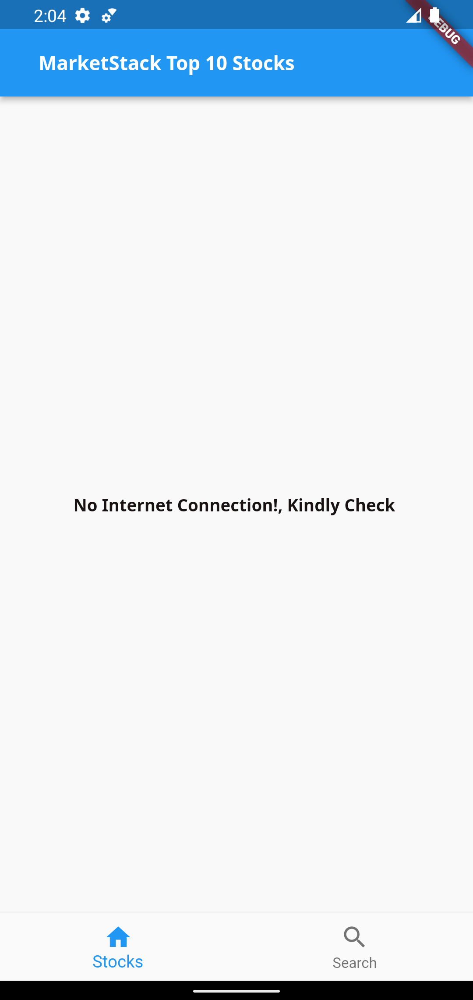

# MarketStack Stock Market App

## Description
MarketStack Stock Market App is a Flutter built mobile application that shows stock details for 10 random companies;using [MarketStack APIs](https://marketstack.com/). 
The app contains features such as date range selection and an auto complete search box to filter the data from the API resource.

## Features
 - Feature 1: List of random companies in the Stock Market with the price value and details
 - Feature 2: Autocomplete search-feature to filter from the list of companies
 - Feature 3: Internet Connection Checker to Notify when the device is offline
 - Feature 4: Date Range Picker to filter Stock value of companies fetched.


## Dependencies Used in the Flutter Project
- Bloc State Management (Cubit)
- Pull-to-Refresh
- Google Fonts
- connectivity_plus (internet connection checker)
- get_it (dependency injection for bloc)
- json annotation
- http
- mocktail (Mock test library)
- equatable

### Code Architecture
   The Codebase uses MVVM Clean Architecture with Block(Cubit) as Statemanagement which separates into four main layers namely.
   1. Data Layer: This layer handles data sources, repositories, and data models
   2. Domain Layer: The domain layer defines the business logic and use cases of the app
   3. Presentation Layer: This layer is responsible for UI, user interactions, and displaying data to users. It includes widgets, views, and view models (or view states) which are responsible for managing UI-related logic.
   4. Infrastructure Layer: The infrastructure layer contains code related to third-party api service.

## Running The App

#### `NB: This app is in null-safety. Therefore, to run the app with no dependency conflicts and issues, you need to install flutter sdk version between '>=2.18.1 <3.0.0' to run the app.`

.

##### Steps

1. Clone the repo
   With ssh

    ```sh
    git@github.com:AYOMITIDE-OAJ/marketstack-stockapp.git
    ```

   With https

    ```sh
    [https://github.com/ayomitide-oaj/marketstack-stockapp](https://github.com/AYOMITIDE-OAJ/marketstack-stockapp)
    ```

#### `NB: The most up to date branch is main`

2. Run: `flutter pub get` to get the packages and dependencies setup/installed
3. Run the app using `flutter run lib/main.dart` to run the app.

##  App Release
- Open a terminal or command prompt and navigate to your Flutter project's root directory.
- Run the following commands to build the app for release:
```bash
1. flutter clean
2. flutter build apk --release   // For Android
3. flutter build ios --release   // For iOS

```
## File & Folder Hierarchy

```
🟨
lib
├── App
|   ├── appentry.dart
|
├── deoendencyinjection
|   ├── di.dart
| 
├── stock
|   ├── cubit
|      ├──stock_cubit.dart
|      ├──stock_observer.dart
|      ├──stock_state.dart
|   
|   ├── viewmodel
|      ├──stock_viemodel.dart
|
|   ├── views
|      ├──stock_page.dart
|      ├──stock_screen.dart
|
├── widgets
|      ├── colors.dart
|      ├── index.dart
|      ├── loader_custom.dart
|      ├── loading_widget.dart
|      ├── no_network_Widget.dart
|      ├── typography.dart
|   
|   
|   ├── main.dart
|   |
|   ├── marketstackapi
|     ├── api
|       ├── api_service.dart
|     ├── models
|        ├── index.dart
|        ├── stock.dart
|        ├── tickers.dart
├     ├── repository
|        ├── marketstack_repository.dart
|  
|   └── test
|        ├── marketstackapi_test.dart 
├
└── pubspec.yaml

```

## Screenshots





